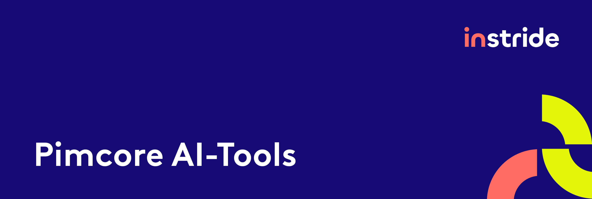

This bundle provides simple AI tools for pimcore. 
Currently, there are three prompt types (Text creation, optimization and correction) integrated.

## Features
- Admin-Helpers:
  - New Document editable "AiWysiwyg" (extended from pimcore_wysiwyg editable) 
  - New Pimcore object data type "AiWysiwyg" (extended from wysiwyg data type) 
  - Configuration module with default settings and list of all types used as well as the option to configure prompts and providers individually  
- Frontend-Helpers
  - New UIkit component "AiHelper"
  - New Symfony form field type "AiTextareaType" (uses the "AiHelper" component)

## Requirements

- Pimcore `^11.0`

## Further Information

- [Installation & Configuration](docs/00-installation-configuration.md)
- [Editable Type](docs/01-editable.md)
- [DataObject Type](docs/02-data-objects.md)
- [UIkit AiHelper](docs/03-uikit-ai-helper.md)
- [Symfony Form Type](docs/04-form-type.md)
- [Add additional providers](docs/05-additional-providers.md)
- [Admin user permission](docs/06-user-permission.md)

## Possible planned features

- Prompt options and defaults for these options (partially prepared)
- Image prompts (partially prepared)
- Translation prompts
- Localization support
- Image generation in backend

## License
**instride AG**, Sandgruebestrasse 4, 6210 Sursee, Switzerland  
connect@instride.ch, [instride.ch](https://instride.ch)  
Copyright © 2024 instride AG. All rights reserved.

For licensing details please visit [LICENSE.md](LICENSE.md) 
