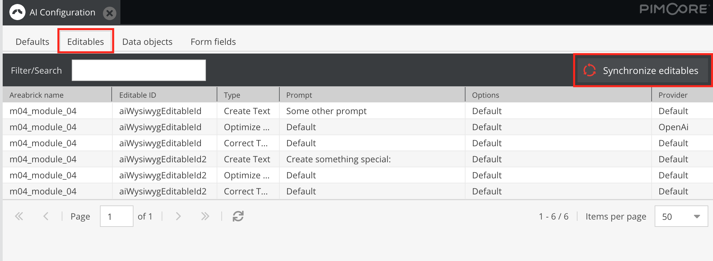

# Editable

### Add editable

Add the "pimcore_ai_wysiwyg" editable to your areabrick template:

```html
<div>
    {{ pimcore_ai_wysiwyg("aiWysiwygEditableId", {areabrick: areaId}) }}
</div>
```

The areabrick option is used for the editable configuration (see at bottom).

### Configure editable

The "pimcore_ai_wysiwyg" extends the default pimcore WYSIWYG editable. See official [Pimcore Documentation](https://pimcore.com/docs/platform/Pimcore/Documents/Editables/WYSIWYG/)

### Register editable (and areabrick)

Create an entry for each editable:

```yaml
pimcore_ai_tools:
    editables:
        m04_module_04:
            - aiWysiwygEditableId
            - aiWysiwygEditableId2
```

In this example the m04_module_04 is the id of the areabrick.

### Synchronize editables & change prompt/provider

- Open up the "AI Configuration" module (under Settings)
- Go to "Editables" and click on "Synchronize editables" 
- Your new editable should now be available in the list, and you (or your users) can change the prompt and provider.
