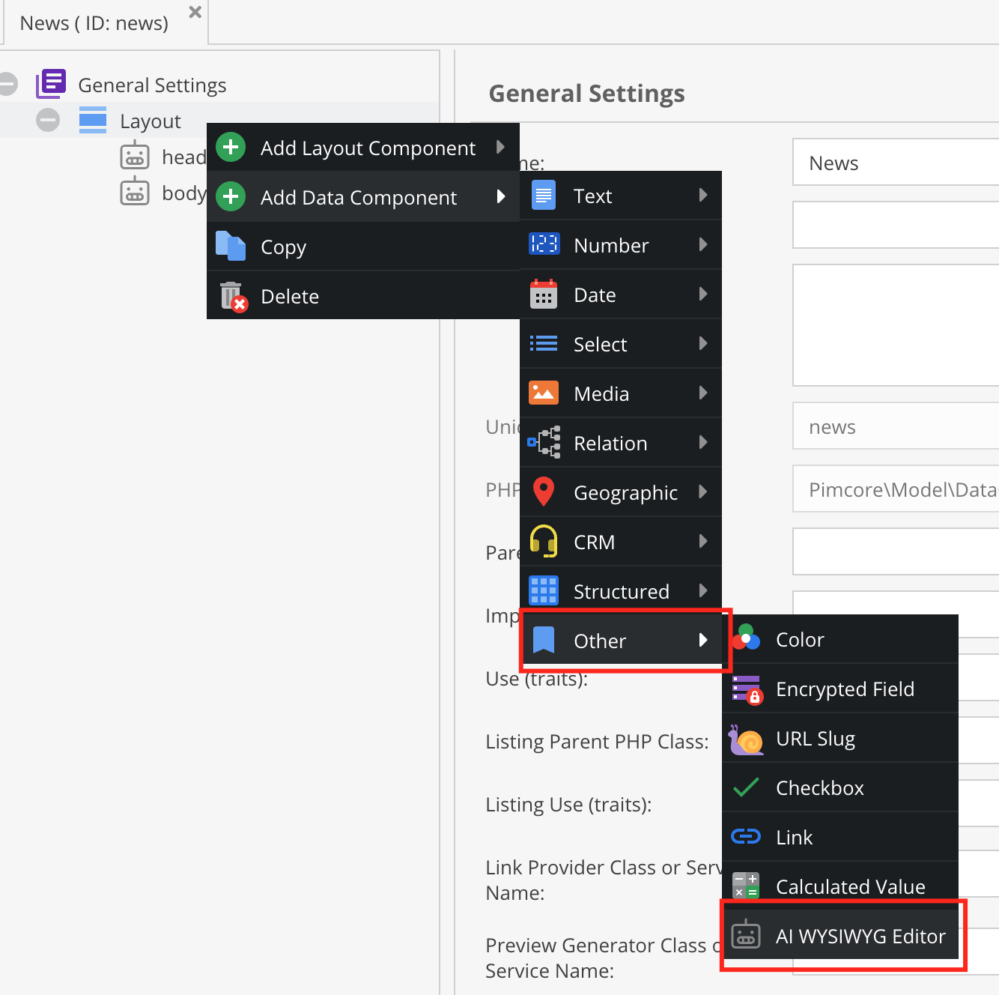

# Data objects

### Add field

Add the "AI WYSIWYG Editor" data type to your object:

### Configure field

The "AI WYSIWYG Editor" extends the default pimcore WYSIWYG data type. See official [Pimcore Documentation](https://pimcore.com/docs/platform/Pimcore/Objects/Object_Classes/Data_Types/Text_Types#wysiwyg)

### Synchronize fields & change prompt/provider

- Open up the "AI Configuration" module (under Settings)
- Go to "Data objects" and click on "Synchronize data objects" 
- Your new field should now be available in the list, and you (or your users) can change the prompt and provider.
