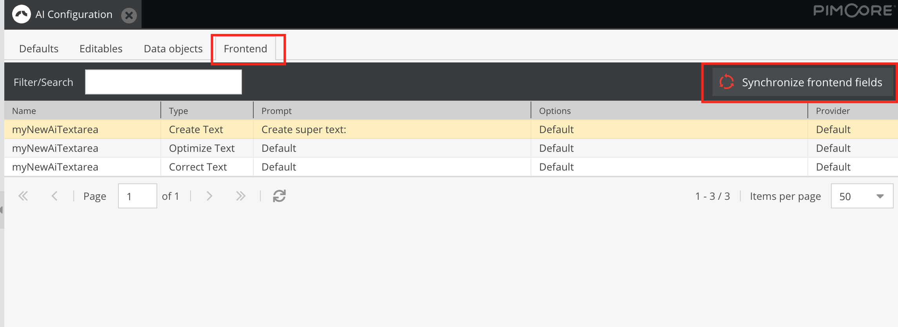

# UIkit or Tailwind AI-Helper Component

### Requirements

- UIkit or Tailwind with activated dropdown, modal and spinner components

### Configure
Define the environment variable to set the preferred "Framework".
```dotenv
FRONTEND_FRAMEWORK="tailwind" // or FRONTEND_FRAMEWORK="uikit"
```

### Load JavaScript for Uikit

Add the pimcore-ai-tools.js (vendor/instride/pimcore-ai-tools/src/PimcoreAiToolsBundle/Resources/assets/js/) to your project:

If you use webpack, include a new entry

```javascript
const paths = {
  ...
  pimcoreAiTools: resolve(__dirname, './vendor/instride/pimcore-ai-tools/src/PimcoreAiToolsBundle/Resources/assets'),
  ...
};
... 
    .addEntry('js/pimcore-ai-tools', `${paths.pimcoreAiTools}/js/pimcore-ai-tools.js`)

    .addPlugin(
      new webpack.DefinePlugin({
        FRONTEND_FRAMEWORK: JSON.stringify(
          process.env.FRONTEND_FRAMEWORK || "tailwind",
        ),
      }),
    )
```

and include it in your template (webpack encore):

```html
{{- encore_entry_script_tags('js/pimcore-ai-tools') }}
```

### Usage

#### Uikit example

```html
<a data-uk-ai-helper="
    promptType: text_creation;
    textareaId: #my-textarea;
    aiToolsId: myNewAiTextarea;
    spinnerId: #my-uikit-spinner;"
   href="#">
    {{ 'pimcore_ai_tools.form.text_create'|trans }}
</a>
```

#### Tailwind example
```html
<a href="#"
   class="block px-4 py-2 text-sm text-gray-700 hover:bg-gray-100"
   data-prompt-type="text_creation"
   data-textarea-id="#{{ id }}"
   data-spinner-id="#pimcore-ai-tools-spinner"
   data-ai-tools-id="{{ ai_tools_id }}">
    {{ 'pimcore_ai_tools.form.text_create'|trans }}
</a>
```

#### Required Options

- **promptType**: Type of prompt ("text_creation", "text_optimization" or "text_correction")
- **textareaId**: ID of textarea field
- **aiToolsId**: ID/Name for admin configuration module (has to be registered -> see below)
- **spinnerId**: ID of UIkit spinner element, which gets activated while prompt is requested

#### Example Usage

See [Example usage](../src/PimcoreAiToolsBundle/Resources/views/form/uikit_3_layout.html.twig)
See [Example usage](../src/PimcoreAiToolsBundle/Resources/views/form/tailwind_layout.html.twig)

### Register "frontend" items

Create an entry for each "aiToolsId":

```yarn
pimcore_ai_tools:
    frontend:
        - myNewAiTextarea
```

### Synchronize items & change prompt/provider

- Open up the "AI Configuration" module (under Settings)
- Go to "Frontend" and click on "Synchronize frontend fields" 
- Your new field should now be available in the list

*Note: The bundle creates all three prompt types (creation, optimization, correction) automatically, even if you only use one of them* 
