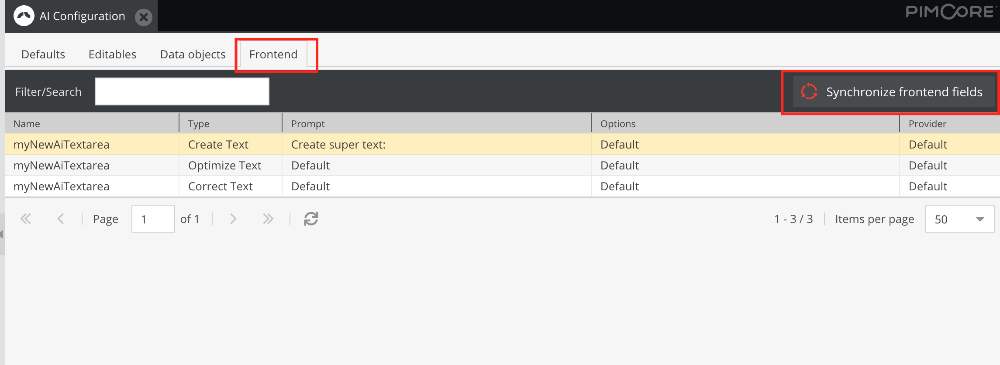

# Symfony Form Type

### Requirements

- Get [UIkit AI-Helper Component](03-uikit-ai-helper.md) to work

### Add form field

```php
use Instride\Bundle\PimcoreAiToolsBundle\Form\Type\AiTextareaType;
...
    public function buildForm(FormBuilderInterface $builder, array $options)
        {
            $builder
                ...
                ->add('myAiTextareaField', AiTextareaType::class, [
                    'label' => 'some label',
                    'ai_tools_id' => 'idForTheAdminConfigurationModule',
                ])
                ...
        }
...
```

### Register form field

Create an entry for each form field inside pimcore_ai_tools.frontend:

```yarn
pimcore_ai_tools:
    frontend:
        - myAiTextareaField
```

### Synchronize items & change prompt/provider

- Open up the "AI Configuration" module (under Settings)
- Go to "Frontend" and click on "Synchronize frontend fields" 
- Your new field should now be available in the list
