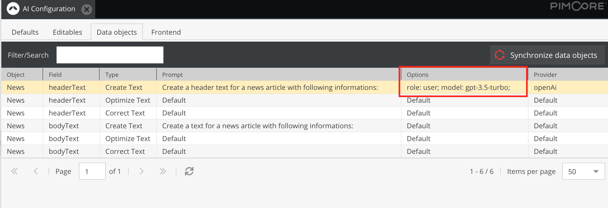

# OpenAI Provider Options

### Currently implemented options

- **role**: Supported values are: 'system', 'assistant', 'user', 'function', and 'tool'.
- **model**: See [here](https://platform.openai.com/docs/models) for more information

### Syntax

Add your options semicolon separated to the configuration.
> option1: value; option2: other value;

Example: 
> role: user; model: gpt-3.5-turbo;

